# Verkauf: Neuwertiges RMH in Adelsdorf

<!-- Do not add page number on this slide -->
<!--
_paginate: false
-->

**PROVISIONSFREI**

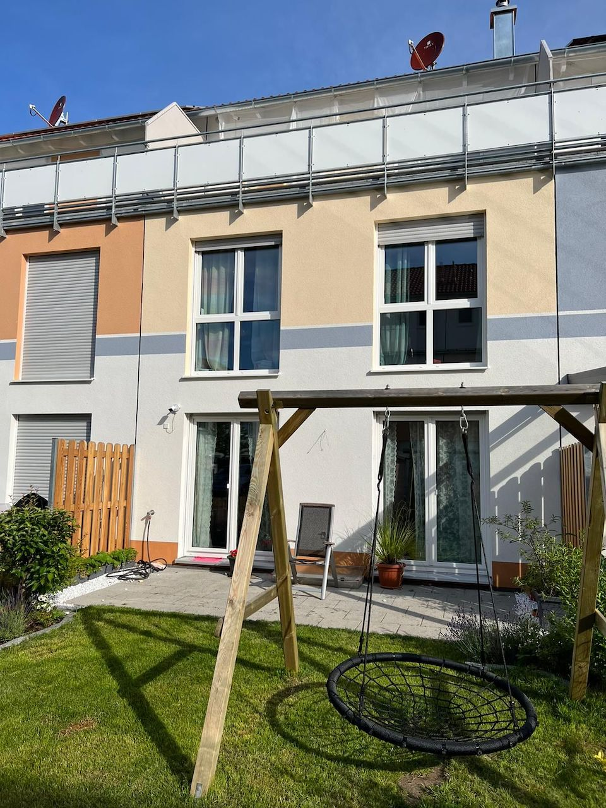
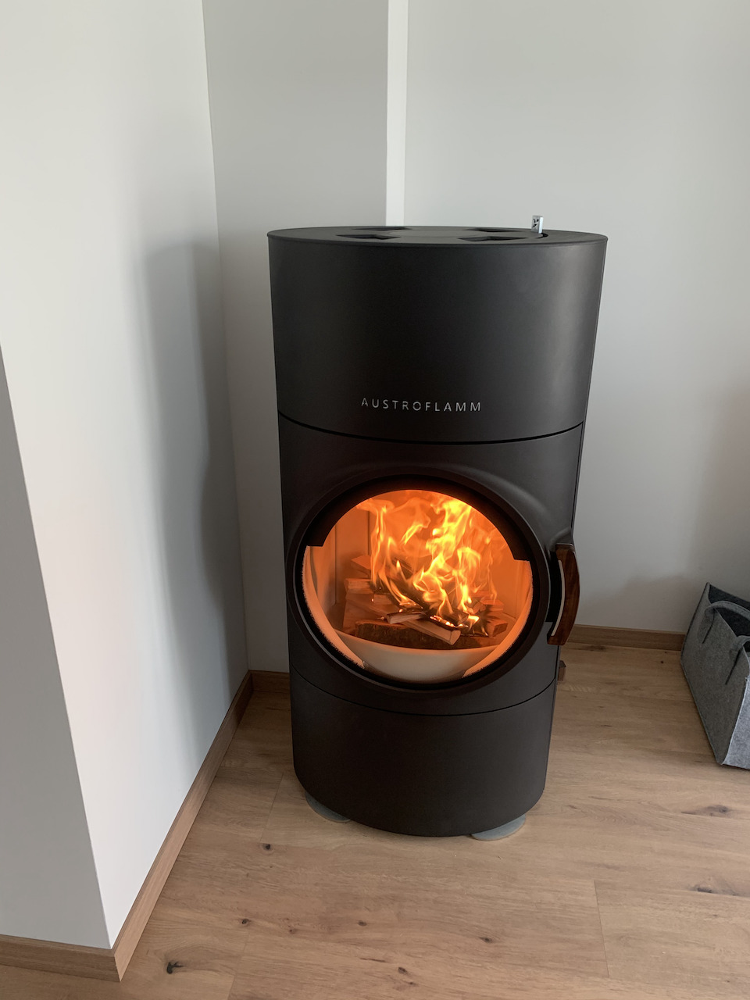

Barschweg 19
91325 Adelsdorf

---

# Objektbeschreibung

<!-- Add footer starting from this slide -->
<!--
footer: 'Tel: +49 160 2028 774 / Barschweg 19, 91325 Adelsdorf / Preis: 554 000 €'
-->

> Das neuwertige Reihenmittelhaus (Hausstil Smile) wurde 2020 in qualitativ hochwertiger Massivbauweise errichtet.
> Alle Außenwände sind aus Kalksandstein mit Wärmedämmverbundsystem und Oberputz.
>
> Die Wohnfläche beträgt 162 m2 und verteilt sich auf drei großzügige Ebenen (EG mit gepflegtem Garten, OG, Dachstudio mit Dachterrasse).
> Die Nutzfläche beträgt ca. 57 m2. Grundstück ca. 167 m2.
>
> Die Immobilie ist voll unterkellert. Im komplett gefliesten Keller findet man folgende Räume vor: Technikraum mit Hausanschlüssen, Hobbyraum und Stauraum. Im Anschlussraum wurde zusätzlich eine Enthärtungsanlage installiert.
>
> Eine moderne zentrale Wohnraumlüftung mit Wärmerückgewinnung sichert Ihnen einen gleichmäßigen Austausch von verbrauchter und frischer Luft. Das energieeffiziente Haus ist mittels einer Gasbrennwertterme beheizt. Die Warmwasserbereitung erfolgt über einen Warmwasserspeicher.
>
> Im Eingangsbereich findet man ein heller Flur mit Garderobe. Eine separate Gästetoilette steht ebenfalls zur Verfügung.
Ein schöner, offen gestalteter Wohn- Essbereich mit Kaminofen wirkt sehr einladend. Durch das Sichtfenster des Kaminofens der Marke Austroflamm kann man das faszinierende Flammenspiel im Feuerraum betrachten. Perfekt für kalte Tage ist die fantastische Wärmespeichersystem.
Die hochwertige Nolte Einbauküche ist im Kaufpreis inbegriffen.
Von Wohnzimmer aus gelangen Sie über zwei Flügeltüren zu privatem gut gepflegtem Garten. Ein großes Gartenhaus mit zusätzlichem Stauraum sowie eine robuste Schaukel stehen Ihnen zur Verfügung. Der hochwertige Gartentor inkl. Schloß bietet den Zugang zur ruhigen Straße.
Über eine Treppe gelangt man ins Obergeschoss. Hier findet man drei unterschiedlich große Schlafzimmer und ein modernes Tageslichtbad mit Dusche , Badewanne, WC, Waschbecken und manuelle Hygienedusche. Alle Fliesen in den Nassräumen sowie in der Küche wurden geschmackvoll ausgewählt.
Ein weiterer Treppenaufgang führt zum Dachgeschoss. Es dient als Elternschlafzimmer. Von hier aus hat man Zutritt auf die 13m2 große Dachterrasse mit fantastischem Fernblick inmitten der Natur.  Hier finden Sie viel Platz für Ihre wertvolle Privatsphäre.
>
> Das Wohnhaus ist mit einem Glasfaseranschluss (1000Mbit/s max. Download) und einem Videoüberwachungssystem ausgestattet.
>
> Besonders praktisch: 2 Stellplätze befinden sich direkt vor dem Haus.
>
> Der Gesamtpreis des angebotenen Grundstücks mit Wohnhaus und zwei Stellplätzen beträgt `554 000` €.
Optional kann eine Einzelgarage für einen Kaufpreis von `30 000` € erworben werden.
>
> Die Immobilie ist aktuell nicht bewohnt und ein Bezug ist jederzeit möglich.

---

# Ausstattung

- zentrale Wohnraumlüftung mit Wärmerückgewinnung
- Highspeed-Internet mit Glasfaser (1000Mbit/s max. Download)
- Ethernet Anschluss auf jeden Stock
- Weichwasseranlage [Grünbeck softliQ:SD21](https://www.gruenbeck.de/produkte-loesungen/gruenbeck-fuer-zuhause/enthaertungsanlagen/kalkschutz/softliqsd)
- Gasbrennwertterme mit Warmwasserspeicher
- Videoüberwachungssystem

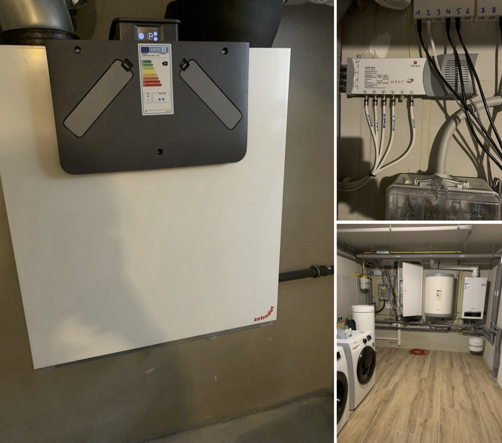

---

# Kaminofen

- [Austroflamm Clou Xtra](https://www.austroflamm.com/de/oefen/kaminoefen/clou-xtra-2-0-21314)
- Xtra Wärmespeicher-Technologie
- [DIBt-Zulassung](https://www.ofen.de/wissenscenter/infothek/verordnungen-gesetze/dibt-wie-wichtig-ist-die-zertifizierung)
- Wärmeleistung - 8 kW
- Großartiges Design

> faszinierende Flammenspiel im Feuerraum betrachten

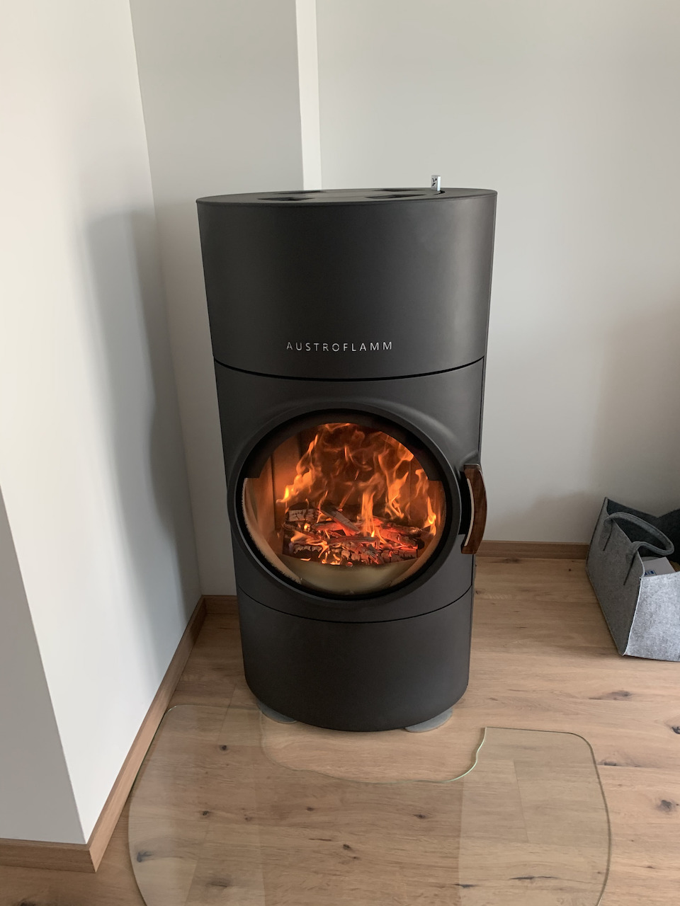

---

# Wunderschöner Garten

> Von Wohnzimmer aus gelangen Sie über zwei Flügeltüren zu privatem gut gepflegtem Garten. Ein großes Gartenhaus mit zusätzlichem Stauraum sowie eine robuste Schaukel stehen Ihnen zur Verfügung. Der hochwertige Gartentor inkl. Schloß bietet den Zugang zur ruhigen Straße.

---

# EG

> Ein schöner, offen gestalteter Wohn- Essbereich mit Kaminofen wirkt sehr einladend. Durch das Sichtfenster des Kaminofens der Marke Austroflamm kann man das faszinierende Flammenspiel im Feuerraum betrachten. Perfekt für kalte Tage ist die fantastische Wärmespeichersystem.
Die hochwertige Nolte Einbauküche ist im Kaufpreis inbegriffen.

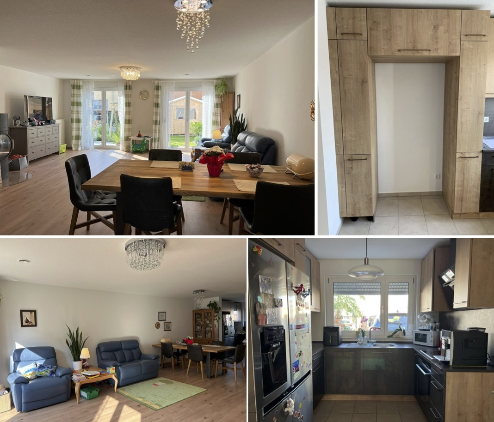

---

# OG

> Über eine Treppe gelangt man ins Obergeschoss. Hier findet man drei unterschiedlich große Schlafzimmer und ein modernes Tageslichtbad mit Dusche , Badewanne, WC, Waschbecken und manuelle Hygienedusche.

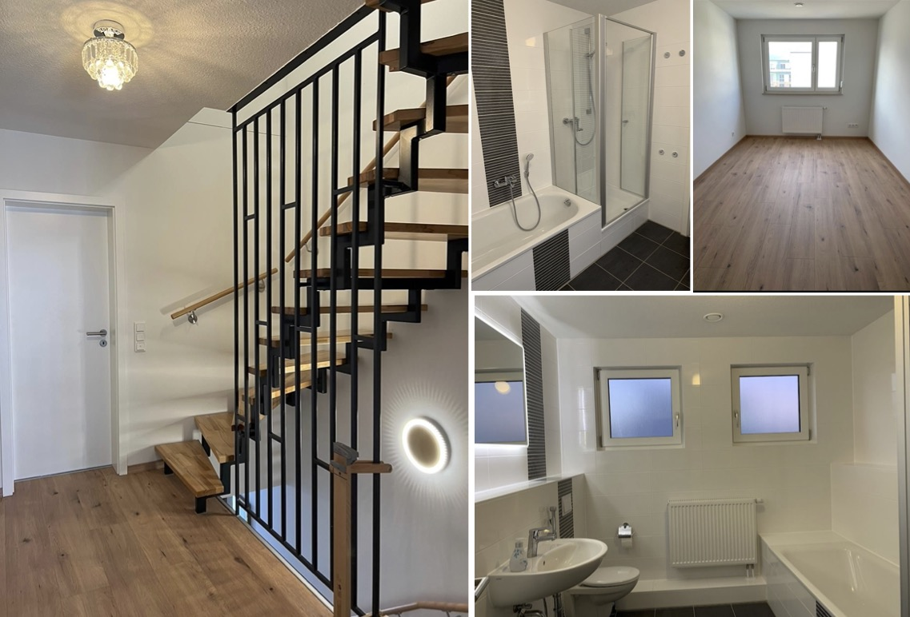

---

# Studio mit Balkon und Ausblick

> Ein weiterer Treppenaufgang führt zum Dachgeschoss. Es dient als Elternschlafzimmer. Von hier aus hat man Zutritt auf die 13m2 große Dachterrasse mit fantastischem Fernblick inmitten der Natur.  Hier finden Sie viel Platz für Ihre wertvolle Privatsphäre.

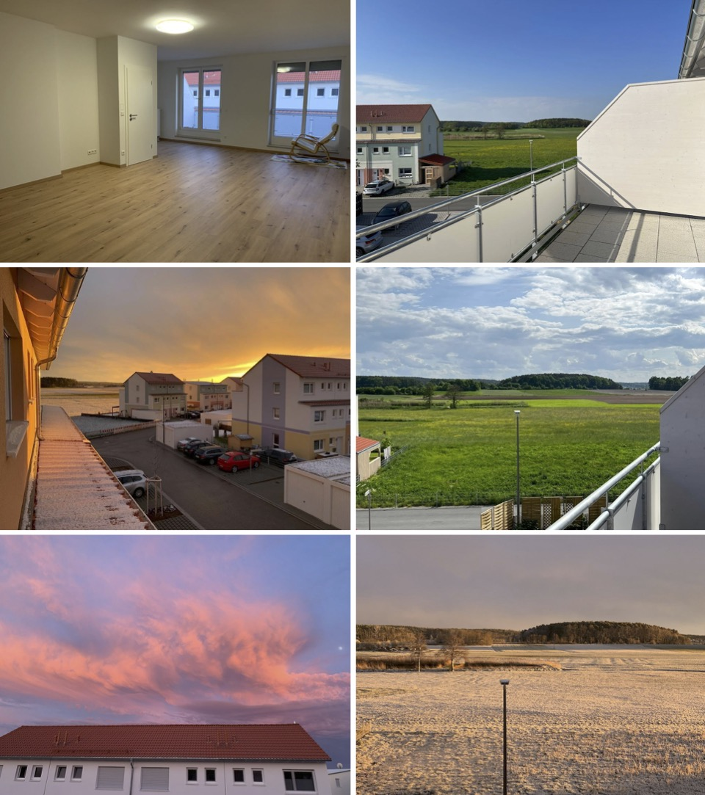

---

# UG

> Die Immobilie ist voll unterkellert. Im komplett gefliesten Keller findet man folgende Räume vor: Technikraum mit Hausanschlüssen, Hobbyraum und Stauraum. Im Anschlussraum wurde zusätzlich eine Enthärtungsanlage installiert.

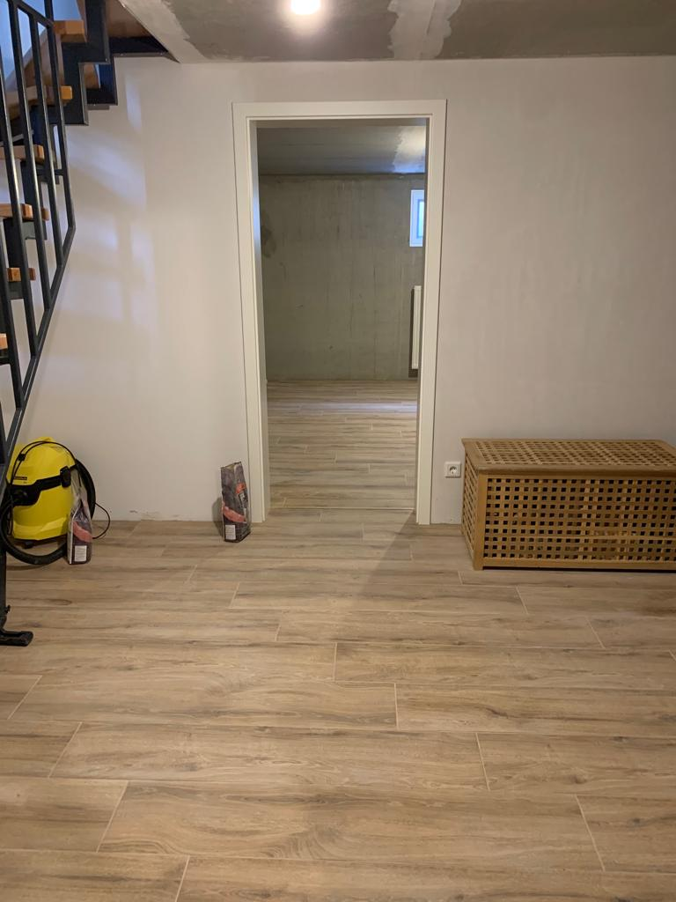
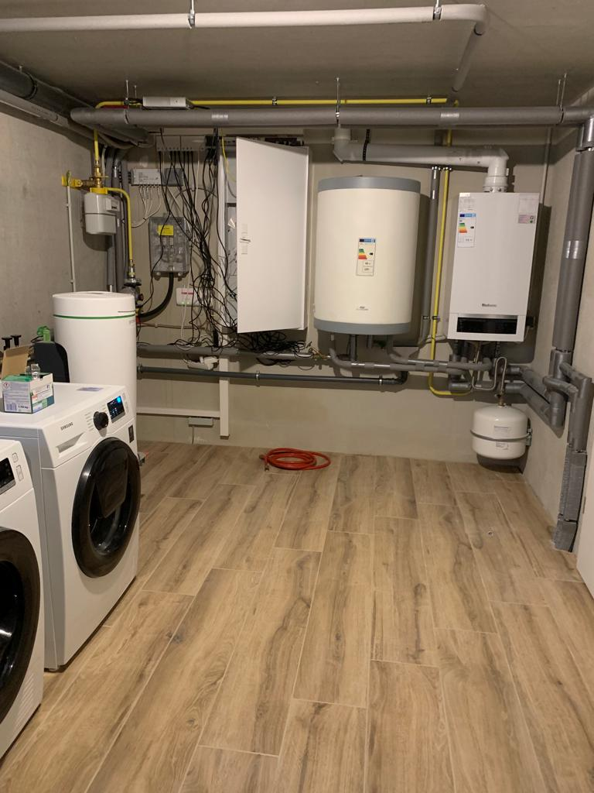

---

# Eingang

> Besonders praktisch: 2 Stellplätze befinden sich direkt vor dem Haus.

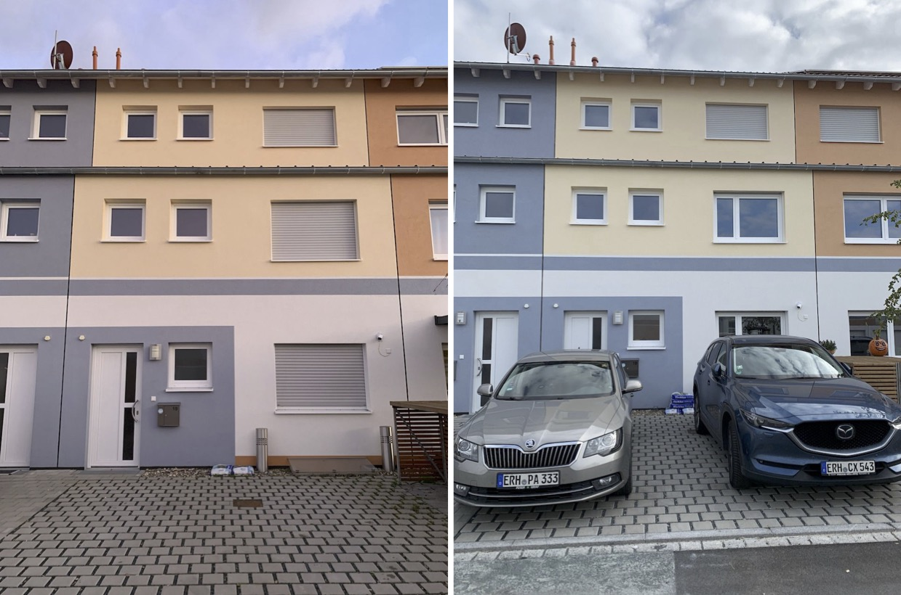

---

# Garage

> Optional kann eine Einzelgarage für einen Kaufpreis von `30 000` € erworben werden.

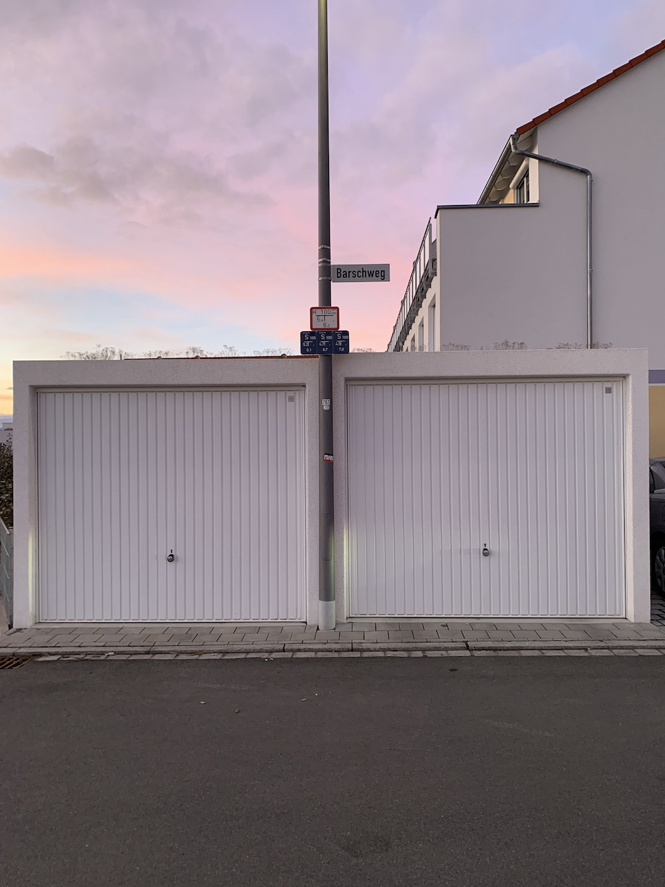

---

# LAGE

> Das Reihenmittelhaus befindet sich in einem familienfreundlichen Neubaugebiet “Seeside” in Adelsdorf.
>
> Die Gemeinde Adelsdorf liegt mitten im Aischgrund und verfügt über eine ausgezeichnete Infrastruktur.
> Hier finden Sie Grund- und Mittelschule, verschiedene Kindergärten, Banken, Tankstellen, Sportvereine, Fitness, Post, gute ärztliche Versorgung, Apotheken, zahlreiche Freizeiteinrichtungen und kulturelle Angebote, Gastronomie und Einkaufsmöglichkeiten für den täglichen Bedarf.
>
> Adelsdorf liegt gut erreichbar an der A3 und an der B470, die zwischen Forchheim und Rothenburg verläuft.
> Mehrere Busverbindungen sichern die Anbindung in die Städte der Umgebung (z.B. Höchstadt, Forchheim, Erlangen).

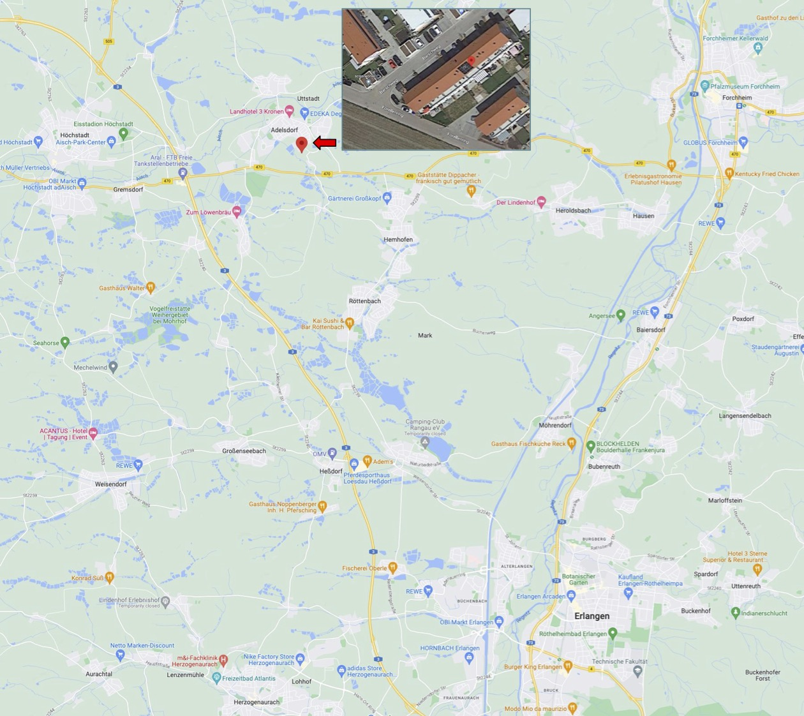

---

# Grundrisse

- Kellergeschoss
- Erdgeschoss
- Obergeschoss
- Dachstudio

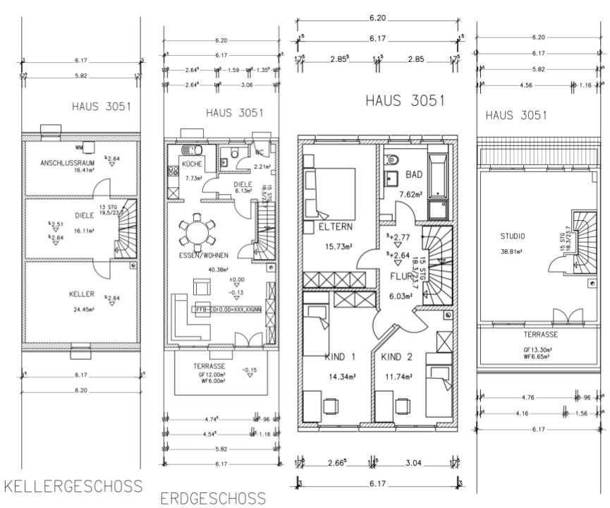

---

# Grundrisse-2

- Schnitt
- Eingangsansicht
- Gartenansicht

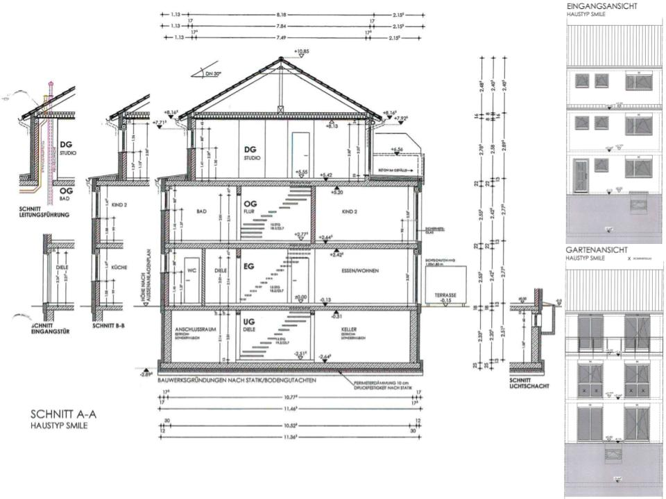

---

# Energieeffizienz

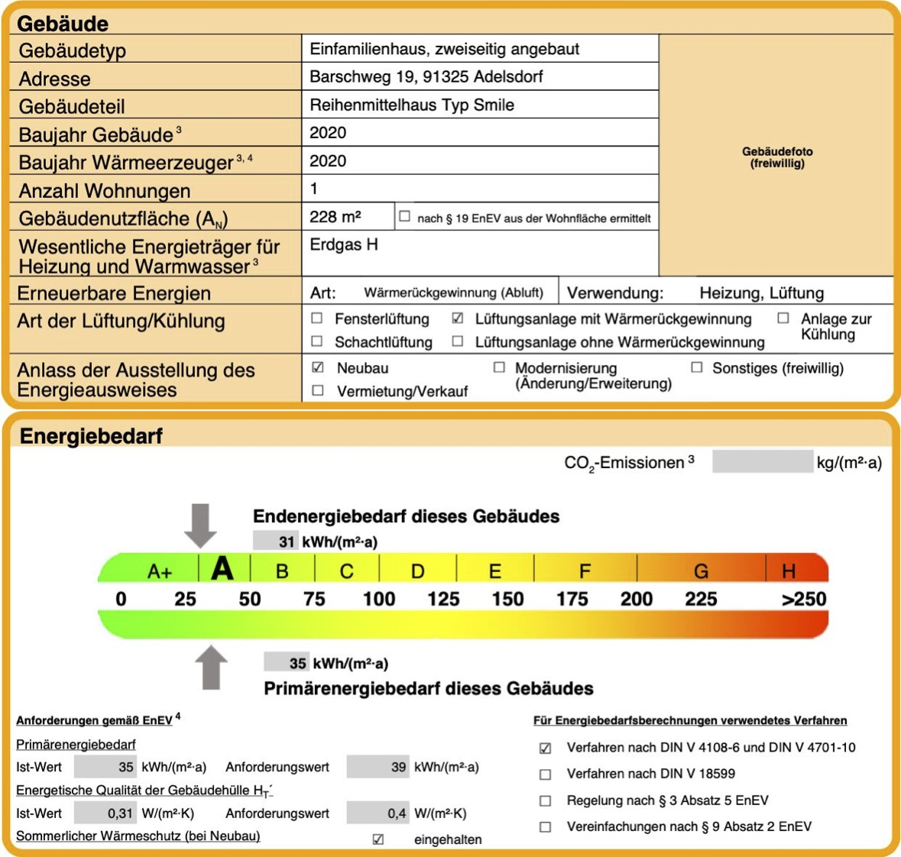

Energieausweis | bedarfsorientiert
---|---
Energiebedarf | 31 kWh/(m2a)
Gebäudeart laut Energieausweis | Wohngebäude
Wesentliche Energieträger | Erdgas  
Ausstellungsdatum Energieausweis | 17.11.2020
Energieausweis gültig bis | 16.11.2030
Baujahr laut Energieausweis | 2020
---

# Konditionen

- Kaufpreis 💶: 554 000 EUR + 30 000 EUR Garage
- Provisionsfrei
- Sofort bezugsfertig
- Ansprechpartner:
  - Zoya Ankudinova
  - Telefon: `+49 160 2028 774`
