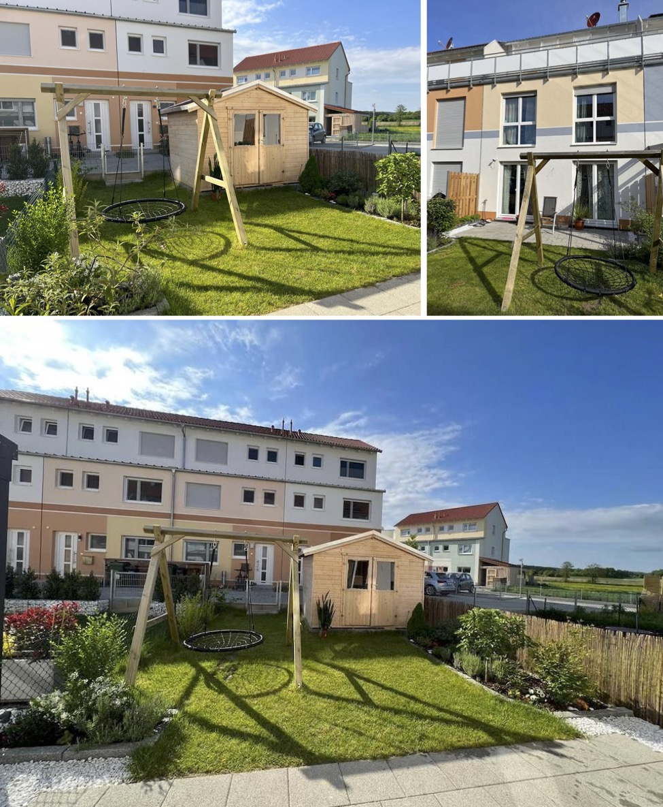

# Verkauf: Neuwertiges RMH in Adelsdorf

**PROVISIONSFREI**

Barschweg 19
91325 Adelsdorf

---

# Objektbeschreibung

---

# Ausstattung

---

# Kaminofen

- [Austroflamm Clou Xtra](https://www.austroflamm.com/de/oefen/kaminoefen/clou-xtra-2-0-21314)
- Xtra Wärmespeicher-Technologie
- [DIBt-Zulassung](https://www.ofen.de/wissenscenter/infothek/verordnungen-gesetze/dibt-wie-wichtig-ist-die-zertifizierung)
- Wärmeleistung - 8 kW
- Großartiges Design

---

# Wunderschöner Garten

---

# EG

---

# OG

---

# Studio mit Balkon und Ausblick

---

# UG

---

# Eingang

---

# Garage

---

# LAGE

---

# Grundrisse

---

# Grundrisse-2

---

# Energieeffizienz

Energieausweis | bedarfsorientiert
---|---
Energiebedarf | 31 kWh/(m2a)
Gebäudeart laut Energieausweis | Wohngebäude
Wesentliche Energieträger | Erdgas  
Ausstellungsdatum Energieausweis | 17.11.2020
Energieausweis gültig bis | 16.11.2030
Baujahr laut Energieausweis | 2020
---

# Konditionen

- Kaufpreis 💶: 554 000 EUR + 30 000 EUR Garage
- Provisionsfrei
- Sofort bezugsfertig
- Ansprechpartner:
  - to-be-defined
  - Telefon: to-be-defined
